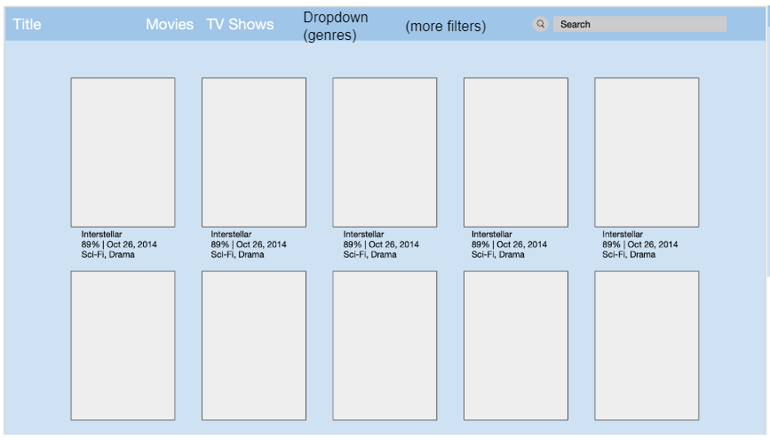
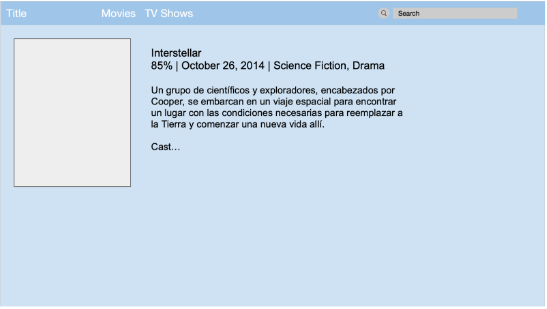
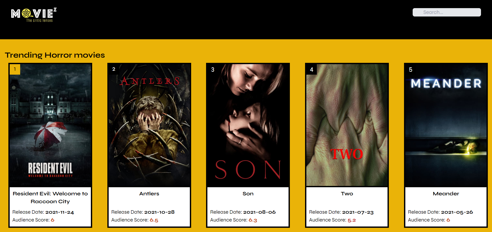
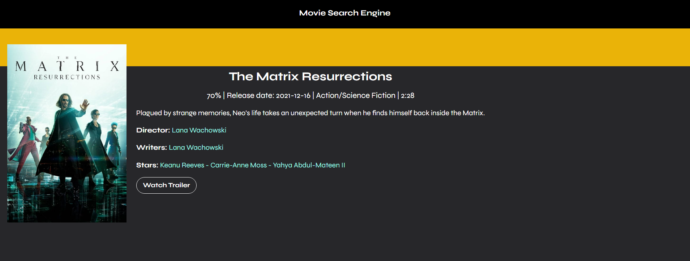

# Movie-Search_Engine

1st Group Project

Summary:

The project consists of a web-page designed to work as a movie search engine, this way people will be able to consult a movies rating,
release date, the movie´s plot, and external articles related to that specific film. Users will be presented with a list of most popular movies right when they access the site. Also an input is available for people to search a specific movie. The site is designed to be viewed in all devices, this way it has a better user experience.

To access the movie information, users must select the image and will be redirected to another HTML in which specific data about the film is presented.

Deployed App: https://enrique-rojas-villegas.github.io/Movie-Search_Engine/

USER STORY:

AS A movie watcher 
I WANT to be able to input a search criteria into a search engine 
SO THAT it can recommend me movie(s) that are currently playing at the cinema or streaming.

BREAKDOWN OF GENERAL TASKS:

1. Creation of a GitHub repo to manage Project Issues.
2. Creation of HTML and CSS to style the webpage.
3. Use of JavaScript functions to return information from APIs.
4. Use of JavaScript logic applied in functions to generate a search by word, or a predefined option given by the site.
5. Implementation of search filters.
6. Dynamically change the options displayed on the webpage once an option is loaded.
7. Implementation/Use of localStorage to remember past searches.
8. Implementation of media queries by external frameworks to be a responsive site for major devices.
9. Interactive buttons to access an actors or directors information.

10. Sketch of the Design

This was the first idea for the Search Engine, but since has been modified to add different characteristics.

2. Accurate Sketch of the Designed once modified to final characteristics

3. This next image is the second HTML where the user is taken once clicked on the preferred movie.

Tools Used in this Project:

1. External Framework: TailWind CSS
   This framework runs the media queries, styles, navbar and buttons. Serves as an easier management for the project, very different to bootstrap, you don't get pre-made elements, you get classes and build up your component, giving you more control over the element.

2. JavaScript: JQuery
   To make Vanilla JavaScript easier and to use shortcuts when using other methods.

3. Button Looks: Font Awesome

4. APIs:
   The Movie DataBase(TMDB): Documentation ---> https://developers.themoviedb.org/3/getting-started/introduction 
   Wikipedia: Documentation ---> https://www.mediawiki.org/wiki/API:Main_page 

Actual Mockup of the finished Web-site: 
This site is responsive to different screen sizes, you can open your DevTools and check the differences in it.

Individual Movie Mockup:

This site is responsive to different screen sizes, you can open your DevTools and check the differences in it.

Respository: https://github.com/Enrique-Rojas-Villegas/Movie-Search_Engine.git
